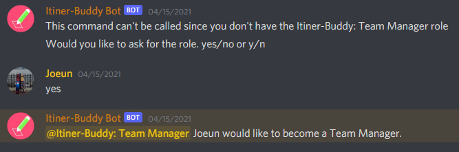
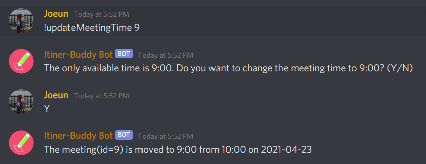
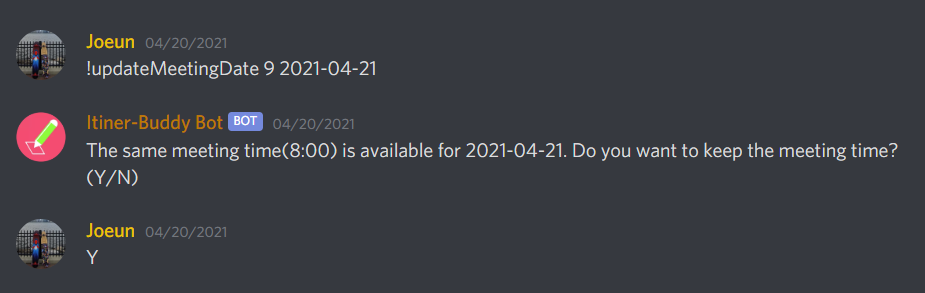
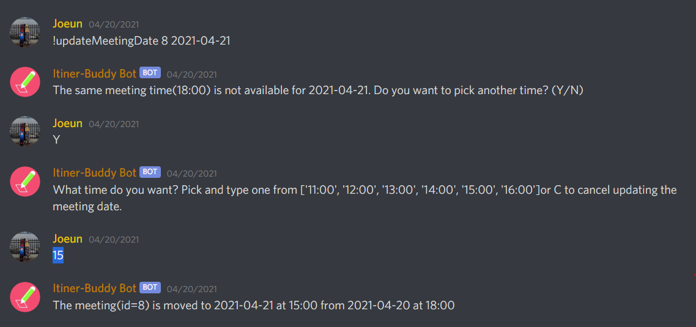
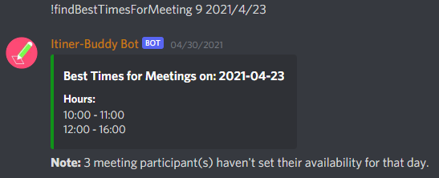

# Itiner-buddy
Itiner-buddy is a Discord bot allowing Discord users to schedule and manage meetings in Discord's channels as remote meetings become inevitable. Aimed to help team leaders schedule meetings based on the bot's suggestions and allow participants to manage their available times for meetings.

# General Users
The typical user of Itiner-buddy bot will be a discord user of any sort looking to organize a large group of users. We want to gear our product to professionals who are looking to use Discord as a platform to communicate with their colleagues and associates online. Itiner-buddy bot will be available to anyone who runs a server (Discord).

# What You Can Do with Itiner-buddy

<h3>1. Create a Meeting</h3>

- Create a meeting on the specified date.
- Required Role to use : Itiner-Buddy: Team Manager

<h3>2. Apply Role</h3>

- Give others the "Itiner-Buddy: Team Manager" role which allows them to create, edit and delete meetings.
- Required Role to use : Admin or Itiner-Buddy: Team Manager

<h3>3. Update a Meeting</h3>

- Update meeting title, date and time.
- When you set the date & time, you will be able to get recoomandations of the meeting time based on the participants.
- Required Role to use : Itiner-Buddy: Team Manager and the meeting host

<h3>4. Cancel a Meeting</h3>

- Cancel a scheduled meeting.
- Required Role to use : Itiner-Buddy: Team Manager and the meeting host

<h3>5. View Upcomming Meetings</h3>

- View a list of upcomming meetings scheduled.
- Required Role to use : All Members

<h3>6. Invite Member/Role To a Meeting</h3>

- Invite and add member(s) or role(s) or everyone in the channel as participants to a meeting
- Required Role to use : All Members

<h3>7. Set a Reminder</h3>

- Set a reminder for a meeting as a specified time before the meeting starts
- Required Role to use : All Members

<h3>8. Manage Available Times</h3>

- Set, delete, and view your own available or preferred times for meetings.
- Required Role to use : All Members

<h3>9. View All Members' Available Times</h3>

- View every member's available times
- Required Role to use : Itiner-Buddy: Team Manager

<h3>10. Get Recoomandations of The Meeting Time</h3>

- Get a list of times for a meeting that is within meeting participants' available times and doesn't conflicts with their other meetings.
- Required Role to use : Itiner-Buddy: Team Manager

# Play Around Itiner-buddy Yourself
[Join the Discord Server.](https://discord.gg/3ESCGGRZ) Itiner-buddy is waiting for you!
